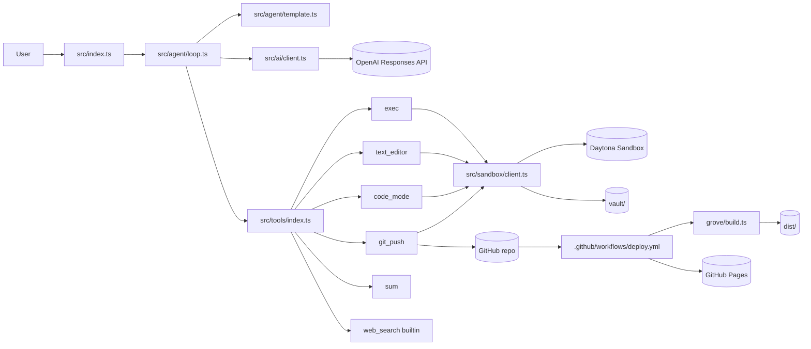

# 04_01_garden Agent - Concepts and Architecture Components

This note describes the architecture of the `04_01_garden` agent for visualization work.
It focuses on concepts, components, boundaries, data flow, and deployment path.

## 1) System Intent

The project combines an LLM agent with a sandboxed execution environment and a static-site pipeline:

- The agent edits and enriches markdown content in `vault/`.
- The static builder (`grove/`) transforms markdown into HTML in `dist/`.
- A deploy workflow publishes `dist/` to GitHub Pages.

In short: **conversation-driven content operations -> markdown vault updates -> static build -> web publish**.

## 2) Core Concepts (Visualization Vocabulary)

Use these as concept nodes in diagrams.

### Agent Runtime Concepts

1. **Turn-based orchestration**
   - A bounded loop executes the LLM turn by turn.
   - Exact fragment: `"for (let turn = 0; turn < config.maxTurns; turn++)"` from `src/agent/loop.ts`.

2. **Tool-call mediation**
   - The LLM can return `function_call` items, which are routed to local handlers.
   - Exact fragment: `"type === \"function_call\""` from `src/agent/loop.ts`.

3. **Response chaining**
   - The runtime links calls with `previous_response_id` to preserve model-side context.
   - Exact fragment: `"previous_response_id: params.previousResponseId"` from `src/ai/client.ts`.

4. **Token accounting**
   - Total token usage is accumulated per run.
   - Exact fragment: `"totalTokens += response.usage?.total_tokens ?? 0"` from `src/agent/loop.ts`.

### Prompt/Governance Concepts

5. **Template-driven agent identity**
   - Agent instructions, model, and allowed tools are loaded from markdown frontmatter.
   - Exact fragment: `"const { data, content } = matter(raw)"` from `src/agent/template.ts`.

6. **Workflow injection**
   - Workflow markdown files are dynamically appended to instructions.
   - Exact fragment: `"You MUST follow a workflow when the user's request matches one."` from `src/agent/template.ts`.

7. **Date-aware instructions**
   - `{{date}}` placeholders are replaced at runtime.
   - Exact fragment: `"replaceAll(\"{{date}}\", today)"` from `src/agent/template.ts`.

### Execution Environment Concepts

8. **Lazy sandbox provisioning**
   - The Daytona sandbox is created only on first need.
   - Exact fragment: `"if (!this.instance) { ... daytona.create({ language: \"typescript\" }) ... }"` from `src/sandbox/client.ts`.

9. **Bidirectional vault sync**
   - Vault is uploaded into sandbox at init, then synced back on destroy.
   - Exact fragments:
     - `"sandbox: synced ${vaultCount} vault files"` from `src/sandbox/client.ts`
     - `"sandbox: synced ${count} vault files back"` from `src/sandbox/client.ts`

10. **Remote workdir abstraction**
    - Tool execution and file IO target `workspace/repo`.
    - Exact fragment: `"const WORKDIR = \"workspace/repo\""` from `src/sandbox/client.ts`.

### Publishing Concepts

11. **Content compiler**
    - Markdown + frontmatter -> HTML page model -> layout render.
    - Exact fragments:
      - `"const { data, content } = matter(raw)"` from `grove/markdown.ts`
      - `"content: marked.parse(content, { async: false }) as string"` from `grove/markdown.ts`
      - `"const html = render(page, menu)"` from `grove/build.ts`

12. **System-content isolation**
    - `vault/system` is excluded from public page build.
    - Exact fragment: `"if (entry.name === \"system\") continue;"` from `grove/build.ts`.

13. **Path-based deploy trigger**
    - GitHub Pages deploy runs on updates to `vault/**`, `grove/**`, `menu.json`.
    - Exact fragment: `"paths: [vault/**, grove/**, menu.json]"` from `.github/workflows/deploy.yml`.

## 3) Component Catalog (What to Draw)

### A. Local Runtime Layer

1. **CLI Entrypoint** (`src/index.ts`)
   - Accepts user message from argv.
   - Creates `LazySandbox`.
   - Calls `run(message, { sandbox })`.
   - Guarantees cleanup in `finally` (`sandbox.destroy()`).

2. **Agent Loop / Orchestrator** (`src/agent/loop.ts`)
   - Main control loop.
   - Calls model completion.
   - Dispatches tool calls.
   - Stops on natural text answer or max-turn boundary.

3. **Template Loader** (`src/agent/template.ts`)
   - Reads `vault/system/main.agent.md`.
   - Reads all `vault/system/workflows/*.md`.
   - Recursively discovers skill files at `vault/system/skills/**/SKILL.md`.
   - Produces merged instruction string + selected tool names + model.

4. **OpenAI Adapter** (`src/ai/client.ts`)
   - Thin wrapper around `client.responses.create`.
   - Passes model, instructions, input, tools, previous response ID.
   - Requests web search source metadata inclusion.

5. **Tool Registry** (`src/tools/index.ts`)
   - Registers custom function tools.
   - Exposes lookup (`findTool`) and model-facing definitions (`definitions`).
   - Merges built-in tools such as `web_search`.

6. **Console Logger** (`src/agent/log.ts`)
   - Structured turn/tool logs with truncation and status coloring.
   - Also logs built-in web search actions.

### B. Tooling Layer

7. **`exec` Tool** (`src/tools/exec.ts`)
   - Executes only explicitly allowed diagnostic commands in sandbox at repo root.
   - Uses a strict command allowlist (`pwd`, `ls`, `rg`).
   - Blocks shell chaining/redirection and command substitution.
   - Converts non-zero exit to string envelope: `[exit <code>]`.

8. **`text_editor` Tool** (`src/tools/text-editor.ts`)
   - Deterministic file operations: `view`, `search`, `create`, `str_replace`, `insert`, `move`.
   - Enforces path policy and exact-match replacement behavior.
   - Restricts edits/moves to `vault/` and blocks `vault/system/`.

9. **`code_mode` Tool** (`src/tools/code-mode.ts`)
   - Executes TypeScript scripts in the sandbox via `process.codeRun`.
   - Provides typed helper APIs: `codemode.vault.*`, `codemode.runtime.execSafe`, `codemode.output.set`.
   - Returns structured JSON results with captured logs and error envelopes.

10. **`git_push` Tool** (`src/tools/git-push.ts`)
   - Syncs sandbox vault back to local repo.
   - Stages `vault/`, commits, and pushes.
   - Returns no-op if no vault diff.

11. **`sum` Tool** (`src/tools/sum.ts`)
    - Minimal deterministic function tool.
    - Useful as a basic demonstration/testing primitive.

### C. Remote Execution Layer

12. **Daytona Sandbox Manager** (`src/sandbox/client.ts`)
    - Creates and owns remote sandbox lifecycle.
    - Uploads local vault and build-related files.
    - On teardown, downloads modified vault files back.

13. **Sandbox FS + Process APIs** (via Daytona SDK)
    - `sandbox.fs.uploadFile`, `downloadFile`
    - `sandbox.process.executeCommand`
    - Provides the isolated execution substrate for agent tools.

### D. Content + Site Layer

14. **Vault Content Store** (`vault/`)
    - Source of markdown content.
    - Includes both public content and system prompts/workflows.

15. **Static Builder** (`grove/build.ts`, `grove/markdown.ts`, `grove/template.ts`)
    - Scans markdown docs (excluding `system`).
    - Parses frontmatter and markdown.
    - Renders pages through layout template and menu navigation.

16. **Distribution Output** (`dist/`)
    - Generated HTML and static assets.
    - Deploy artifact for GitHub Pages.

17. **CI/CD Workflow** (`.github/workflows/deploy.yml`)
    - Installs with Bun, builds site, uploads artifact, deploys Pages.

## 4) Boundaries and Trust Zones

For architecture diagrams, separate into these trust zones:

1. **Developer Machine (Local)**
   - Bun runtime, source repository, local git state.
   - Agent orchestrator and tool registry live here.

2. **Sandbox (Remote, Isolated)**
   - Command execution and file writes happen here.
   - Receives synced project/vault snapshot.

3. **External APIs**
   - OpenAI Responses API.
   - Built-in web search provider.
   - GitHub remote + GitHub Actions.

4. **Public Surface**
   - GitHub Pages hosting static `dist/` output.

## 5) Primary Runtime Flows

### Flow A - Normal Answer (No Tool)

1. User prompt enters `src/index.ts`.
2. `run()` builds tool list and merged instructions.
3. Completion is requested from OpenAI.
4. If no `function_call` in output, `output_text` is returned to user.

### Flow B - Tool-Assisted Turn

1. Completion output contains `function_call`.
2. Loop extracts calls, parses JSON arguments, resolves each tool.
3. Tool handlers execute (sandbox may initialize lazily).
4. Outputs are wrapped as `function_call_output` messages.
5. Loop continues with `previous_response_id` until final text.

### Flow C - Publish Content

1. Agent calls `git_push`.
2. Vault files are synced back from sandbox to local repo.
3. Tool stages `vault/`, commits, pushes.
4. GitHub Actions runs `bun run build`.
5. `dist/` is deployed to GitHub Pages.

## 6) Data Objects and Interfaces

These are useful for schema-level diagrams.

- **`Tool` interface** (`src/types.ts`)
  - `definition: FunctionTool`
  - `handler(args, context) => Promise<string>`

- **`ToolContext`**
  - Holds `sandbox: LazySandbox`

- **`AgentTemplate`**
  - `name`, `model`, `tools`, `instructions`

- **`AgentResult`**
  - `text`, `turns`, `totalTokens`

- **OpenAI response entities**
  - `ResponseInputItem`
  - `ResponseFunctionToolCall`
  - `ResponseOutputItem`

## 7) Visualization Blueprint (Ready-to-Draw Nodes + Edges)

### Node Groups

- **User Interaction:** User, CLI Entrypoint
- **Agent Core:** Orchestrator, Template Loader, OpenAI Adapter, Tool Registry, Logger
- **Tooling:** exec, text_editor, code_mode, git_push, sum, web_search
- **Execution Substrate:** LazySandbox, Daytona Sandbox FS/Process
- **Content System:** Vault, Grove Builder, Dist
- **Delivery:** GitHub Repo, GitHub Actions, GitHub Pages

### Directed Edges (Recommended Labels)

- User -> CLI (`prompt`)
- CLI -> Orchestrator (`run(message, context)`)
- Orchestrator -> Template Loader (`loadTemplate(agent)`)
- Template Loader -> `vault/system/*.md` (`read + parse frontmatter`)
- Orchestrator -> OpenAI Adapter (`completion(...)`)
- OpenAI Adapter -> OpenAI Responses API (`responses.create`)
- Orchestrator -> Tool Registry (`findTool`, `definitions`)
- Tool Registry -> Tool Handlers (`dispatch`)
- Tool Handlers -> LazySandbox (`get()`)
- LazySandbox -> Daytona (`create/delete sandbox`)
- Tools (`text_editor`, `code_mode`, `exec`) -> Sandbox FS/Process (`io/commands`)
- `git_push` -> Local Git Repo (`add/commit/push`)
- Local Git Repo -> GitHub Actions (`push event`)
- GitHub Actions -> Grove Builder (`bun run build`)
- Grove Builder -> Dist (`html output`)
- GitHub Actions -> GitHub Pages (`deploy`)

## 8) Mermaid Starter (Optional)

## 9) Architectural Characterization

- **Style:** Tool-augmented LLM orchestrator with externalized content store.
- **Control pattern:** Iterative request-response loop with optional function-call branches.
- **Execution model:** Hybrid local orchestration + remote sandbox execution.
- **Content model:** Markdown-first knowledge base transformed into static web artifacts.
- **Operational model:** Push-based CI deployment to GitHub Pages.

